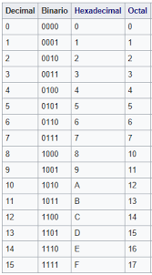

# Memorias

Las memorias de las computadoras guardan y procesan información. 

## Memoria Principal

La RAM (random access memory) es la memoria principal de una computadora. Todos los datos ahí alojados están de manera temporal hasta que el procesador los haya procesado. Esta memoria es volátil ya que cuando no haya energía lo que haya ahí guardado se va a perder.
Dentro de la memoria principal tambien podemos encontrar la memoria "caché". Esta memoria tiene menos capacidad de almacenamiento pero es mucho mas rápida. Se situa entre la CPU y la RAM, de esta forma copia en ésta datos de la memoria RAM para poder acceder a ellos mucho más rápido.
También dentro de la memoria principal podemos encontrar la memoria "ROM (read only memory)". Esta memoria guarda las instrucciones necesarias para que la computadora pueda iniciarse, y como su nombre lo indica, es una memoria de sólo lectura.

## Memoria Secundaria

Su principal función es almacenar información de forma no volátil. Esta memoria es un conjunto de dispositivos que complementan el sistema de memoria.

Tenemos tres grandes grupos de tecnologías para este tipo de almacenamiento:

### Magnéticos

Como su nombre lo indica, usan un sistema de grabación magnético, formado por discos que giran a gran velocidad.
Ejemplos: Diskette, HDD

### De estado sólido

Funciona mediante pulsos eléctricos y no tiene partes móviles.
Ejemplos: Pendrive, SSD

### Ópticos

En esta tecnología los datos pueden ser guardados o leidos a través de un laser.
Ejemplos: CD, DVD, Blu-Ray

## RAM

Esta memoria se conecta a la CPU a través de una ranura llamada "slot". Una placa madre puede contener mas de uno, y se **recomienda**, en el caso de usar dos memorias RAM en la computadora, que sean de la misma capacidad, velocidad, frecuencia, latencia y fabricante. (No es imposible usar dos rams un poco diferentes pero puede que la de mayor capacidad no ofrezca su mejor rendimiento).

### Capacidad

Cantidad de datos almacenables en una RAM. Se mide en Gigabytes.

### Latencia

Cantidad de ciclos de reloj entre una petición y su respuesta.

### Voltaje

Energía consumida por el módulo RAM.

## Unidades de medida

La capacidad de los dispositivos de almacenamiento se mide. 

[Tabla de unidades de medida](https://assets.digitalhouse.com/content/ar/td/iif/infografia%20triangulo.jpg)

## Almacenamineto de datos

### Sistema numérico no posicional
Aquellos en los que el valor de los simbolos del mismo **no** dependen de la posición.

### Sistema numérico posicional
Aquellos en los que el valor de los símbolos **si** dependen de la posicion que ocupa.

#### Sistema Decimal

Formado por diez dígitos, el sistema decimal es el que usamos hoy en dia compuesto por los simbolos 0 1 2 3 4 5 6 7 8 9.

#### Sistema Binario

Como su nombre lo indica, formado por sólo dos simbolos, los digitos son representados por las cifras 0 y 1.

[Contador Binario Mecánico](https://www.youtube.com/watch?v=zELAfmp3fXY)

##### Conversión de Decimal a Binario

### Sistema Octal y Hexadecimal

De base ocho y dieciséis respectivamente.

# Práctica Integradora

## Microdesafíos - Paso I

Decimal | Binario | Hexagesimal | Octal
--------|---------|-------------|------
  0     |  0000   |      0      |   0
  1     |  0001   |      1      |   1
  2     |  0010   |      2      |   2
  3     |  0011   |      3      |   3
  4     |  0100   |      4      |   4
  5     |  0101   |      5      |   5
  6     |  0110   |      6      |   6
  7     |  0111   |      7      |   7
  8     |  1000   |      8      |   10
  9     |  1001   |      9      |   11
  10    |  1010   |      A      |   12
  11    |  1011   |      B      |   13
  12    |  1100   |      C      |   14
  13    |  1101   |      D      |   15
  14    |  1110   |      E      |   16
  15    |  1111   |      F      |   17

## Microdesafíos - Paso II

Decimal | Binario | Hexagesimal | Octal
--------|---------|-------------|------
9516    |---------|-------------|------
--------|---------|-------------|1473
--------|11111111 |-------------|------
--------|011010   |-------------|------
4256    |---------|-------------|------

## Fragmentación, segmentación y paginación

### Fragmentación
Así se llama al espacio que queda desperdiciado al momento de usar los metodos de partición de memoria. Se requiere de un proceso de desfragmentación para "recuperar" ese espacio. 

### Segmentación
Técnica de gestión de memoria que intenta acercarse mas al punto de vista del usuario.
En este caso, un programa es un conjunto de componentes logicos de tamaño variable, o, conjunto de **segmentos**, cada uno con su tamaño y número. La segmentación de un programa es realizada por un compilador y se expresara con las variables *numero de segmento* y *desplazamiento dentro del segmento*.

### Paginación
Tecnica de gestion que permite asignar memoria de forma *discontinua*.
Se divide la memoria en frames de tamaño fijo, y la logica en paginas de igual tamaño. El sistema operativo mantiene internamente una tabla de páginas donde relaciona cada paina cargada en memoria con su respectivo frame (dirección real de memoria).
El sistema operativo analizara el tamaño de un trabajo para buscar una lista de frames libres. Si existen, cargara en ellos las paginas, actualizando la lista de frames disponibles. Cada trabajo en memoria tendra su propia tabla de paginas apuntada por el bloque de control del proceso.
Con este sistema se evita la fragmentacion externa, ya que cualquier frame disponible es asignable a un trabajo.
